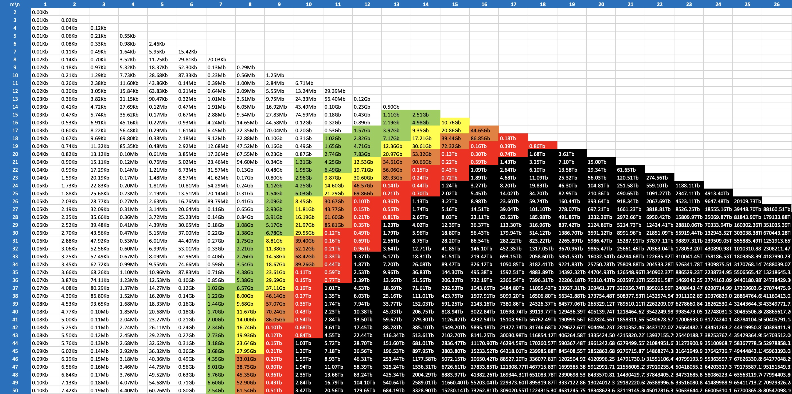

# Quandelibc

This repository is a collection of c-optimized computation primitive available as python module. When possible, the low level function uses INTEL SIMD primitives.

## Checkout, Installation

It is recommended to create a virtual environment for instance with `virtualenv`.

```bash
virtualenv -p python3 venv
source venv/bin/activate
pip install pip --upgrade
```

Dependencies are: `pytest`, `numpy`:

```bash
pip install pytest numpy --upgrade
```

### Installation from pypi

```
pip install quandelibc
```

This will install the latest released version with precompiled builds. <br>

### Installation from source code

Alternatively, you can checkout code from gitlab and compile the module:

```bash
git clone git@github.com:Quandela/QuandeLibC.git --recurse-submodules
cd quandelibc
```

Then compile, install and test the module:

```bash
pip install .
pytest tests
```

## Usage

```python
import quandelibc as qc

qc.permanent_fl([[1]])
```

## Functions & Classes

### `permanent_in`, `permanent_fl`, `permanent_cx`

The functions `permanent_in`/`permanent_re`/`permanent_cx` compute the permanent of a 2D-matrix:

```python
permanent_fl(M, nthreads=0)
```

Where:

* `M` has to be a square int/float/complex matrix
* `nthreads` is indicating the number of threads to use for the calculation. `nthreads=0` will use `thread::hardware_concurrency()` from hardware configuration. To be tuned based on other tasks running on the server.

Computation uses Ryser algorithm with graycode index optimization, uses `AVX` primitives for number multiplication, and run on multiple threads. This has a complexity of `O(n.2^n)`.

Note that for 1 or 2 threads, Glynn algorithm will be used (https://en.wikipedia.org/wiki/Computing_the_permanent#Balasubramanian–Bax–Franklin–Glynn_formula), for 3+ threads Ryser algorithm will be used (https://en.wikipedia.org/wiki/Computing_the_permanent#Ryser_formula).

#### Benchmark

TBD

### Fock states classes

#### `FockState`

`FockState` is a class to manipulate efficiently fock states - it provides the following methods:

* Space-insensitive constructor from strings like: `|s1, ..., sm>` or alternative representations using `[]`, `()` or `|〉`.
* constructor of vaccum state `FockState(m)` => `|0,...,0>`
* constructor of elementary state `FockState(m,mk)` => `|0, 0, ..., 1, ..., 0>`
* `+` and `+=` operators - to combine two fock states
* `++` or `+`(int) to produce following fockstates in *(m,n)-*`FSArray` order with end condition `|0,0,0,...,m>+1==|0,0,0,...0>`
* cast to python iterator e.g: `list(fs) => [s1,...,sm]`
* string serialization `str(fs) => |s1,s2,...,sm>`
* `__hash__` function allowing them to be indexed
* comparison operators to check egality or differences of two fock states
* `__getitem__` methods providing direct access to mode: `fs[4]`
* `__copy__` function allowing shallow and deepcopy
* `m` and `n` properties: `fs.m`, `fs.n`
* `prodnfact` equals to `prod(mi=1;mi<=m) !s_mi`

#### `FSArray`

`FSArray` is a class representing all the possible fock states for given in `(m,n)` fock space.

An `FSArray` is simply built given these 2 parameters.

```python
>>> fsa = qc.FSArray(10,5)
>>> print(fsa)
<quandelibc.FSArray object at 0x109d7d830>
```

The internal structure is built as soon as methods `__getitem__`, `find`, `save` is called, or when a `FSArray` is used to build a `FSMap` (see below).

It is therefore possible to request the size in bytes of the structure in memory, or the count of different fock states using `size` or `count` methods *before* an actual building of the object.

```python
>>> print(fsa.size(), fsa.count())
10010 2002
```

Note that due the nature of the fock state spaces - the size can quickly goes far beyond available memory.

```python
>>> fsa = qc.FSArray(36,18)
>>> print("size=%fGb" % (fsa.size()/1024./1024/1024))
size=1083236.358076Gb
```

Internally, the fock states are represented by a sequence `M1M2M3M4...Mn` where each `Mi` represents the mode of i-th photon, and the `Mi`s are sorted in increasing order. This representation is unique and more dense than the reverse fock representation `s1...sn`.
Practically, the number of modes is restricted to 255 allowing to represent each mode as a char. For readibility, mode 0 is represented by letter `A`, mode 1 letter `B`, ...

> **_NOTE_**: The *(m,n)* fock-state array size is *n.C(m+n-1,n)* - by restricting to 4 bits only (32 modes maximum), the fock states could be compacted 50% - however as we will see below `FSMap` representations are actually far larger so this optimisation is not necessary.

When a `FSArray` is built, the generated state list is in lexicographic order on that internal representation. For instance:

```python
>>> fsa = qc.FSArray(4,2)
>>> for i in range(fsa.count()):
...   print(fsa[i])
[2, 0, 0, 0] # corresponding to AA
[1, 1, 0, 0] # corresponding to AB
[1, 0, 1, 0] # corresponding to AC
[1, 0, 0, 1] # corresponding to AD
[0, 2, 0, 0] # corresponding to BB
[0, 1, 1, 0] # corresponding to BC
[0, 1, 0, 1] # corresponding to BD
[0, 0, 2, 0] # corresponding to CC
[0, 0, 1, 1] # corresponding to CD
[0, 0, 0, 2] # corresponding to DD
```

This lexicographic order is useful to retrieve efficiently (in *O(log_2 Mn)* operations) the index of a given state through the `find` method:

```python
>>> print(fsa.find([0, 2, 0, 0]))
4
```

Last, `FSArray` objects can be serialized with `save(path)` method. If `path` is a directory, the object will create an object named `layer-mM-nN.fsa` containing a binary representation of the object. Otherwise, the provided filename will be used instead.

To retrieve a serialized object, you can use following constructors:

```python
>>> fsa=FSArray(filename, m, n)
```

or passing a directory, the generic name will be looked for:

```python
>>> fsa=FSArray(dirname, m, n)
```

It is also possible to iterate through all states of a `FSArray` without building it through iterators:

```python
fsa=FSArray(20,10)
for fs in fsa:
    print(fs)
```

#### `FSMap`

`FSMap` is a class doing the mapping between a *(m,k)* `FSArray` and a *(m,k+1)* `FSArray`.

For each of the state of the k-FSA, it is possible to add a photon in one of the *m* mode which can be represented as followed for *(m,k)=(2,2)*

* `AA` + `A` = `AAA`
* `AA` + `B` = `AAB`
* `AB` + `A` = `AAB`
* `AB` + `B` = `ABB`
* `BB` + `A` = `ABB`
* `BB` + `B` = `BBB`

A *(m,k)->(m,k+1)* `FSMap` is built given only the *(m,k+1)-*`FSArray`. As for `FSArray` it is built lazily meaning that it is possible to get required size without actually trying to build the objects...

```python
>>> fsa_3216 = qc.FSArray(32,16)
>>> fsm_3215_3216 = qc.FSMap(fsa_3216)
>>> print("%.2fGb" % (fsa_3216.size()/1024./1024/1024))
22399.91Gb
>>> print("%.2fGb" % (fsm_3215_3216.size()/1024./1024/1024))
91506.02Gb
```

The number of keys is *M_k*, for each *m* possible modes, and each index is compressed to the minimal number of bytes able to address *M_(k+1)* states. In the following example, we have 32 modes, and the pointers are 6-bytes long:

```python
>>> print(fsm_3215_3216.size()/fsm_3215_3216.count()/32)
6
```

> **_NOTE_**: The memory needed to keep in memory the full stack of *(m,0)-(m,n)* `FSArray`s and the final layer `FSArray` is represented in the following image. In white and green the configurations that will fit on any laptop (less than 8Gb of memory), in yellow and orange configurations that could run on a large memory server (upto 128Gb memory), in red configuration that could run on very large servers. In black - configurations that cannot be realistically simulated.



As for `FSArray`, objects can be serialized to files with `save(file_or_dir_path)` and deserialized with constructor `FSMap(file_or_dir_path, m, n)`.

To find mapping between *(m,k)* fock state index and *(m,k+1)* fock state index - use `get(idx, m)` method:

```python
>>> idx_kp1 = fsm.get(idx_k,mk)
```
